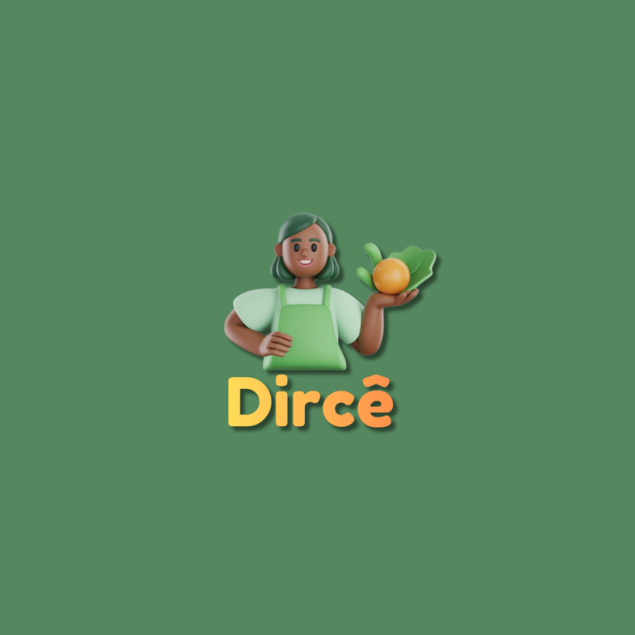

# Dircê

  

  <i>Economia circular para garantir alimento de qualidade, acessível, rastreável e com dignidade — do campo à mesa.</i>

---

## Membros da Equipe

  <table>
    <tr>
      <td align="center">
        <a href="https://www.linkedin.com/in/yt-yukitanaka/">
           
          <b>Yuki Tanaka</b>
        </a>
      </td>
      <td align="center">
        <a href="https://www.linkedin.com/in/marcos-morais79/">
           
          <b>Marcos Morais</b>
        </a>
      </td>
      <td align="center">
        <a href="https://www.linkedin.com/in/barbarapeslo">
           
          <b>Bárbara Lopes</b>
        </a>
      </td>
        <td align="center">
            <a href="https://www.linkedin.com/in/flaviagonmac/">
             
          <b>Flávia Macêdo</b>
        </a>
      </td>
    </tr>
  </table>

---

## Descrição

**Dircê** é uma infraestrutura digital de impacto social criada para enfrentar um dos maiores desafios estruturais do país: a **segurança alimentar**, do campo à mesa, desenvolvida para o **Hackathon Devs de Impacto**.

Nosso propósito é conectar **o campo à mesa** promovendo acesso, rastreabilidade e dignidade por meio da tecnologia.
A Dircê tem o foco em:

- ampliar o acesso a alimentos saudáveis e de qualidade,  
- fortalecer produtores locais e a economia circular,  
- reduzir perdas e ineficiências na cadeia alimentar,  
- garantir transparência e rastreabilidade da produção ao consumo,  
- promover inclusão social por meio de tecnologias acessíveis.  

Inspirada na complexidade dos sistemas alimentares, a Dircê traduz dados, fluxos e relações em
**decisões mais justas, eficientes e transparentes**, tornando visível o que hoje opera de forma *fragmentada*.

---

## Valores da Marca

### **Dignidade Alimentar**
Acesso à alimentação saudável como direito básico, respeitando as realidades sociais e territoriais.

### **Inclusão e Acessibilidade**
Tecnologia pensada para todos, com uso de cartão físico e atendimento por áudio via IA.

### **Economia Circular**
Fortalecimento da economia local, mantendo recursos dentro do território e apoiando pequenos produtores.

### **Rastreabilidade e Transparência**
Uso de blockchain para garantir rastreabilidade, confiança e controle social.

---

## Problema

Fragilidade sistêmica na logística, na rastreabilidade e na acessibilidade comprometem a garantia da segurança alimentar. 

O desafio do Hackathon:

> **"Como criar soluções tecnológicas inovadoras (Junto com a IA) para fortalecer a segurança alimentar? do campo à mesa"**

---

## O que a Dircê resolve

- 🥗 **Garante acesso a alimentos de qualidade** para usuários do CadÚnico  
- 💳 **Utiliza cartão físico**, simples e aceito em maquininhas  
- 🔄 **Estimula a economia circular local**  
- 🌱 **Fortalece a agricultura familiar e produtores locais**  
- 🧠 **Oferece suporte por IA via áudio**, promovendo acessibilidade  
- 🔐 **Registra transações em blockchain**, assegurando transparência  
- 📍 **Conecta CRAS, usuários, produtores e parceiros** em um único ecossistema  
---

## Fluxo de Funcionamento da Solução

1. **Identificação do Beneficiário**  
   • Validação automática a partir do Cadastro Único.

2. **Entrega do Cartão Dircê no CRAS**  
   • Cartão físico habilitado para uso em estabelecimentos parceiros. 

3. **Crédito da Moeda Social**  
   • O usuário recebe 200 créditos (1 moeda social =  1R$) mensalmente em Dircê.

4. **Compra de Alimentos**  
   • Uso do cartão Dircê em maquininhas de produtores e comércios cadastrados.
   • Estimativa de impacto energético.

5. **Incentivo Fiscal aos Produtores e Comércios**  
   • Produtores e estabelecimentos cadastrados passam a ter acesso a **benefícios fiscais**, 
   como abatimento de impostos, mediante participação no ecossistema Dircê e cumprimento 
   dos critérios do programa.

## Tecnologias

- React 18 com Vite e TypeScript
- Tailwind CSS e shadcn-ui para interface
- React Router v6 para navegação
- Web Speech API para reconhecimento de voz
- NestJS com TypeScript no backend
- Prisma ORM com PostgreSQL
- Integração com APIs externas (Google Maps e Eleven Labs)
- Blockchain Stellar (Testnet) com token customizado REFEICAO
- Uso do @stellar/stellar-sdk para emissão e transações de ativos
- IA/ML elevenlabs

---
## 🥕 Uma nova visão para o sistema alimentar

A Dircê não é apenas uma moeda.  
É uma ponte entre quem produz e quem precisa, usando tecnologia para garantir comida de verdade que seja rastrável, promova inclusão social, impacto educacional e local.

> **Dircê é seu caminho para alimentação saudável.**

Redeploy forced at 2025-11-30T21:54:46.4148695-03:00
